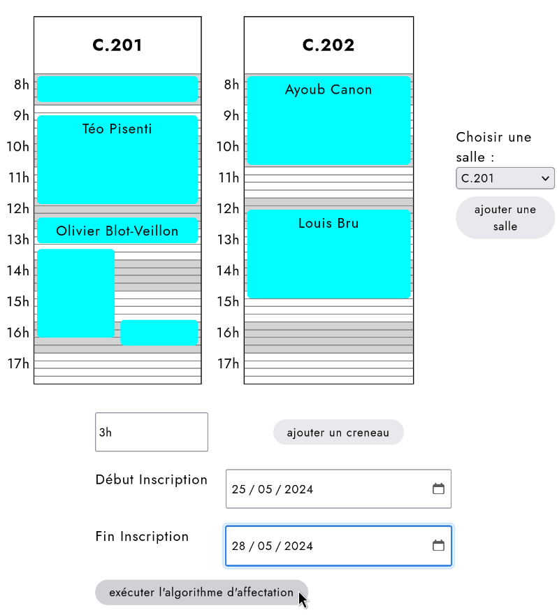
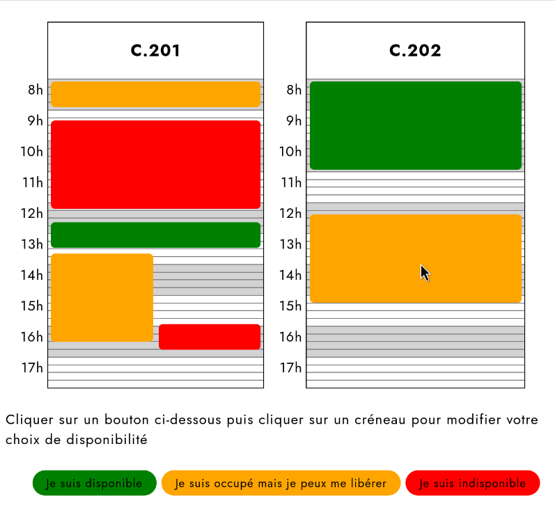

{width="5cm"}

# TLDR: Je veux juste run le projet !!

1. Installez maven et la dernière version d'openjdk
2. Executez `mvn clean package` pour build le projet
3. Executez `./target/server/bin/standalone.sh` pour lancer le projet
4. Allez à l'adresse `http://127.0.0.1:8080/` dans votre navigateur web
5. Pour vous connecter en admin, utilisez le login "teopisenti@gmail.com" et le mot de passe "password"

*Les valeurs par défaut de la base de donnée sont définies dans les fichiers situés dans ./src/main/resources/META-INF/loaderFiles/*

# Introduction

L'objectif de notre application $Volundr$ est de proposer une solution
au problème de l'affectation de créneaux horaires à des élèves ou
groupes d'élèves, par exemple lors d'examens oraux nécessitant un jury
occupant une salle donnée pendant un certain nombre de créneaux
horaires.

# Exemple de l'examen d'Applis Web

La problématique du passage à l'oral de cet examen est de faire passer
des élèves de filières différentes (A,B,L,\...) qui ont tous un emploi
du temps différent.\
Dans un premier temps, le ou les professeurs jury rempliront leurs
disponibilités à l'aide de la page présentée en
[\[fig:modif_event\]](#fig:modif_event){reference-type="autoref"
reference="fig:modif_event"}. En effet, il est possible pour un
professeur de créer un événement (examen, présentation, suivi, \...) et
d'y inviter des élèves et de préciser ses disponibilités en ajoutant des
salles puis des créneaux. Pour ajouter un créneau, il faut rentrer le
nombre de minutes souhaité pour la durée du créneau, cliquer sur
\"ajouter un créneau\" pour enfin pouvoir sélectionner dans la colonne
réprésentant la salle l'horaire de départ du créneau. Le professeur peut
aussi renseigner une date de début et de fin pour les inscriptions des
élèves. Un fois la durée des inscriptions expirée, le professeur peut
cliquer sur \"exécuter l'algorithme\" pour lancer un algorithme
d'affectation qui attribuera à chaque case un élève.\
Du côté des élèves, ils pourront (individuellement ou sous la forme d'un
groupe) noter chaque créneau horaire mis à disposition par le
professeur. Ici, comme nous pouvons le voir dans la
[\[fig:choix_util\]](#fig:choix_util){reference-type="autoref"
reference="fig:choix_util"}, le système de notation est composé de trois
états : \"oui\", \"peut-être\" et \"non\". Pour noter une case, l'élève
doit cliquer sur l'état voulu puis sur la case. Une fois que le
professeur aura éxécuté l'algorithme d'affectation, les élèves auront
accès au créneau qui leur a été attribué dans la liste de leurs
événements.\

# Architecture du projet

## Executer le projet

Le projet utilise maven pour télécharger automatiquement les dépendances
et générer le .war. On utilise wildfly (version communautaire et
maintenue de JBoss) comme serveur. Lancer `mvn build` pour générer le
.war Lancer `mvn wildfly:deploy` pour build et déployer automatiquement
dans wildfly

## Architecture du projet {#architecture-du-projet}

### Les packages Java du back-end sont dans "src/main/java" :

-   **package model :** Entities beans pour l'interaction avec la base
    de donnée

-   **package controller :** L'interface entre le front et le back :

    -   **Rest.java :** La définition de l'API REST utilisée par le
        front-end web au travers de la fonction "fetch" de JavaScript.
        Elle peut être testée avec curl avec les exemples suivants:

            # créer un utilisateur
            curl -XPOST -H "Content-type: application/json" \
            -d '{"mail": "teo@gmail.com", "prenom": "teo", "nom":"p" }' \
            'http://localhost:8080/Volundr/rest/tutorial/addUser'
            # récupérer la liste de tous les utilisateurs de la bdd
            curl "http://localhost:8080/Volundr/rest/tutorial/getUsers"

    -   **Serv.java :** Une servlet utilisée par quelques rares pages
        web qui n'ont pas eu le temps d'être réécrites pour utiliser
        l'api REST

-   **package dataTransfert :** Classes POJO qui servent à représenter
    les entities beans lors des communications entre le back et le
    front. Ce sont des copies des classes du modèle sans les attributs
    qu'on ne veut pas envoyer au client. Elles sont automatiquement
    sérialisées en JSON par l'API REST lors des réponses au client.

### Le code du front-end est dans src/main/webapp :

Vous y trouverez du code jsp qui sert uniquement à générer du code HTML
car on utilise pas de framework de front-end comme React pour le faire.
Par exemple: on l'utilise pour inclure des fichiers html externes sans
devoir copier coller le code dans chaque fichier html.

Pour pouvoir être intéractives, les pages générées utilisent l'API REST
pour interragir avec le back-end grâce à la fonction "fetch" de
JavaScript.

Le dossier "src/main/webapp/webscheduler" contient un composant
permettant d'avoir une nouvelle balise html "volundr-scheduler" pour
gérer l'emploi du temps. Ce widget est écrit "from scratch" avec
uniquement du HTML,CSS,JS avec l'api "webcomponent".

# Annexes

<figure id="fig:choix_util">

<figcaption>Choix par un utilisateur</figcaption>
</figure>

{#fig:modif_event width="\\textwidth"}
